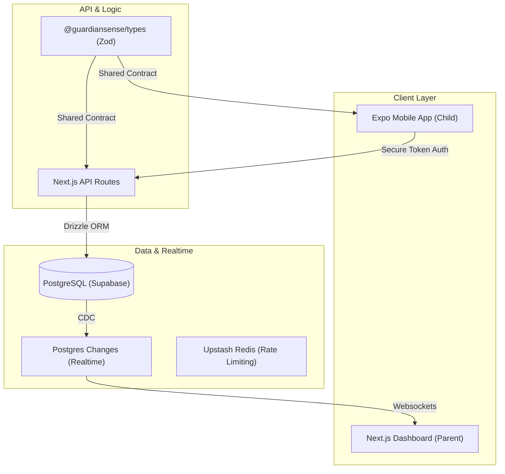

# 🛡️ GuardianSense

[](https://nextjs.org/)
[](https://react.dev/)
[](https://expo.dev/)
[](https://tailwindcss.com/)
[](https://www.typescriptlang.org/)
[](https://orm.drizzle.team/)

**GuardianSense** is a high-performance, real-time child safety ecosystem. It provides parents with "contextual awareness" rather than just location dots, combining location intelligence, device telemetry, and automated geofencing into a premium, fluid dashboard experience.

---

## 🚀 Why This Project Is Impressive

This repository isn't just a "tracker"—it's a full-stack engineering showcase built with a focus on type safety, real-time performance, and modern UI/UX patterns.

- **Monorepo Architecture**: A robust npm-workspace structure that shares logic and types across a Next.js web app and an Expo mobile client.
- **Full-Stack Type Safety**: Leverages **Zod** as a Single Source of Truth. API contracts used by the Next.js backend are the exact same schemas validating data in the Expo mobile app, preventing entire classes of runtime bugs.
- **Real-Time Synchronization**: Implements **Supabase Postgres Replication** to push child location updates and telemetry to the parent dashboard instantly, eliminating the need for manual polling.
- **Notion-Inspired UX**: The parent dashboard features a sophisticated "Instant-Apply" settings model with optimistic UI updates and real-time sync indicators.
- **Deterministic Location Intelligence**: A custom classification engine that maps raw GPS pings to user-defined "Safe Zones" with high precision and low latency.

---

## 🏗️ Technical Architecture



---

## 📂 Project Structure

| Workspace | Purpose | Key Technologies |
|---|---|---|
| [`apps/web`](file:///Users/farooqueazam/Desktop/docu3c/guardianSenseV1/apps/web) | Parent Dashboard & Core Backend | Next.js, Framer Motion, Tailwind 4 |
| [`apps/child`](file:///Users/farooqueazam/Desktop/docu3c/guardianSenseV1/apps/child) | Mobile Tracking Client | Expo, Background Location, EAS |
| [`packages/db`](file:///Users/farooqueazam/Desktop/docu3c/guardianSenseV1/packages/db) | Database Layer | Drizzle ORM, Supabase |
| [`packages/types`](file:///Users/farooqueazam/Desktop/docu3c/guardianSenseV1/packages/types) | Shared Domain Types | Zod, TypeScript |

---

## 🛠️ Installation & Setup

```bash
# Install dependencies across all workspaces
npm install

# Configure environment
cp .env.example .env.local

# Run the entire ecosystem in development mode
npm run dev
```

---

## 🎯 Current Roadmap

- [x] **Phase 1**: Core Real-time Location & Telemetry Pipeline.
- [x] **Phase 2**: Premium Dashboard UI & Responsive Viewport Layout.
- [x] **Phase 3**: "Instant-Apply" Parent Settings & Device Management.
- [/] **Phase 4**: Production Mobile Deployment via Expo EAS.
- [ ] **Phase 5**: Advanced Contextual Alerts (e.g., "Inactive for too long").
